 

# **Sistema Automático de Gestión de Cultivos (SAGC)**

 

**Autores: Camueira Elias; Cascia Serena; Donadello Nicolas**

**Padrón: 110772; 107946; 112007**

**Fecha: 2do cuatrimestre 2025**

# Resumen

En este trabajo se presenta el diseño e implementación de un sistema de control y monitoreo inteligente para cultivos automatizados, basado en la arquitectura ARM Cortex-M3. El sistema tiene como objetivo optimizar el desarrollo de cultivos mediante la regulación de variables críticas como humedad del suelo, temperatura y ventilación. El diseño integra funciones avanzadas como iluminación espectral dinámica controlada por PWM, respaldo de configuración en memoria EEPROM y una interfaz inalámbrica mediante tecnología Bluetooth para la gestión remota desde una aplicación móvil.

La implementación del firmware se realizó en lenguaje C sobre la plataforma STM32 Nucleo-F103RB, utilizando un enfoque de código no bloqueante y gestión por interrupciones. El software se estructura de forma modular mediante tareas independientes y validaciones de estado, garantizando un sistema robusto, eficiente en el consumo energético y con tiempos de respuesta en el orden de los microsegundos.

En este informe se detallan los requisitos del proyecto, el diseño del hardware y los módulos de implementados, el desarrollo del firmware y los resultados de los ensayos funcionales que validan la solución propuesta.

# Índice

## [1. Introducción](#1-introducción)
* [1.1. Objetivos del proyecto](#11-objetivo-del-proyecto-y-resultados-esperados)
* [1.2. Alcance del trabajo](#12-estudio-del-mercado)

## [2. Descripción de Módulos Externos](#2-descripción-de-módulos-externos)
* [2.1. Microcontrolador STM32 F103RB](#21-microcontrolador-stm32-f103rb)
* [2.2. Módulo integrado de Bluetooth de baja energía (BLE)](#22-módulo-integrado-de-bluetooth-de-baja-energía-ble)
* [2.3. Módulo Relay optoacoplado de 2 canales](#23-módulo-relay-optoacoplado-de-2-canales)
* [2.4. Módulo de memoria no volátil EEPROM (AT24C256)](#24-módulo-de-memoria-no-volátil-eeprom-at24c256)
* [2.5. Aplicación móvil para Android (MIT APP Inventor)](#25-aplicación-móvil-para-android-mit-app-inventor)
* [2.6. Módulo de sensor analógico de nivel de agua (HW-038)](#26-módulo-de-sensor-analógico-de-nivel-de-agua-hw-038)
* [2.7. Módulo de sensor analógico de humedad en tierra (HW-390)](#27-módulo-de-sensor-analógico-de-humedad-en-tierra-hw-390)
* [2.8. Módulo de sensor digital de temperatura y humedad (AHT10)](#28-módulo-de-sensor-digital-de-temperatura-y-humedad-aht10)
* [2.9. Módulo de alimentación de 12V](#29-módulo-de-alimentación-de-12v)

## [3. Diseño e Implementación](#3-diseño-e-implementación)
* [**3.1. Esquema General**](#31-esquema-general)
    * [3.1.1. Diagrama en bloques](#311-diagrama-en-bloques)
* [**3.2. Diseño de Circuitos e Implementación**](#32-diseño-de-circuitos-e-implementación)
    * [3.2.1. Diseño de circuitos y módulos](#321-diseño-de-circuitos-y-módulos)
        * [3.2.1.1. Diseño de módulo de Iluminación Dinámica](#3211-diseño-de-módulo-de-iluminación-dinámica)
        * [3.2.1.2. Diseño de módulo de Riego](#3212-diseño-de-módulo-de-riego)
    * [3.2.2. Implementación física (Hardware)](#322-implementación-física-hardware)
* [**3.3. Funcionamiento de Software**](#33-funcionamiento-de-software)
    * [3.3.1. Arquitectura de tareas (Bare-metal y Super-loop)](#331-arquitectura-de-tareas-bare-metal-y-super-loop)
    * [3.3.2. Tareas de Sensores (Analog, Digital, BLE)](#332-tareas-de-sensores-analog-digital-ble)
    * [3.3.3. Tareas de Sistema (Memory, Level, Riego, LED, Ventilación)](#333-tareas-de-sistema-memory-level-riego-led-ventilación)
    * [3.3.4. Tareas de Actuadores (Cooler, LED, Bomba)](#334-tareas-de-actuadores-cooler-led-bomba)

## [4. Resultados de las Mediciones](#4-resultados-de-las-mediciones)
* [4.1. Pruebas funcionales de hardware y software](#41-pruebas-funcionales-de-hardware-y-software)
* [4.2. Prueba de integración](#42-prueba-de-integración)
* [4.3. Análisis de tiempos de ejecución (WCET)](#43-análisis-de-tiempos-de-ejecución-wcet)
* [4.4. Cálculo del Factor de Uso de la CPU](#44-cálculo-del-factor-de-uso-de-la-cpu)
* [4.5. Medición y análisis de consumo energético](#45-medición-y-análisis-de-consumo-energético)
* [4.6. Reporte de uso de memoria (Flash y RAM)](#46-reporte-de-uso-de-memoria-flash-y-ram)
* [4.7. Cumplimiento de requisitos](#47-cumplimiento-de-requisitos)

## [5. Conclusiones](#5-conclusiones)
* [5.1. Resultados obtenidos](#51-resultados-obtenidos)
* [5.2. Próximos pasos y mejoras futuras](#52-próximos-pasos-y-mejoras-futuras)

# 1. Selección del proyecto a implementar

## 1.1. Objetivo del proyecto y resultados esperados

El objetivo de este proyecto es desarrollar un sistema automatizado de cultivo que permita medir, registrar y controlar variables ambientales críticas (temperatura, humedad, riego, fertilización) e implementar iluminación espectral controlada (incluyendo rojo, azul y UV-A) para favorecer el desarrollo óptimo de los cultivos en sus distintas etapas. Además, a través de una aplicación móvil, el usuario puede cargar datos sobre el progreso del cultivo y ajustar parámetros. El sistema utiliza esta información para refinar su respuesta y optimizar el control de acuerdo con las necesidades específicas del cultivo.

## 1.2. Estudio del mercado

En Argentina existen diversos productos orientados al monitoreo y control ambiental para cultivos indoor e invernaderos. Sin embargo, la mayoría de las soluciones disponibles se limita a funciones específicas (como riego, humedad o temporizadores) y no integran en un mismo sistema la totalidad de sensores, actuadores y conectividad inalámbrica que propone este proyecto.

Como primer competidor puede mencionarse a **Wentux (Argentina)**, empresa dedicada al desarrollo de automatización para cultivos indoor. Ofrece controladores de clima, módulos para extracción, temporizadores y dispositivos de riego. Si bien sus productos cubren funciones clave como temperatura y humedad, no incluyen controladores de fertilización, monitoreo de nivel de agua ni conectividad vía Wi-Fi o BLE con una app. Su enfoque está más orientado al control puntual de variables, no a un sistema integral. Además que sus productos y servicios son muy costosos, comparándolo con el que se propone implementar.

Un segundo competidor es **Autoplants Argentina**, que fabrica sistemas automáticos de riego y control básico de humedad para cultivos en interior y exterior. Estos dispositivos permiten controlar el riego y medir humedad ambiente, pero carecen de un sistema unificado que combine ventilación, luz artificial, sensado de varias variables y configuración remota mediante WIFI o BLE. Tampoco integran sensores específicos como nivel de agua.

En conclusión, si bien Argentina cuenta con empresas que producen controladores ambientales y sistemas automáticos para cultivos indoor o invernaderos, ninguna ofrece una solución completa que combine: sensores de humedad de suelo, temperatura, humedad ambiente, nivel de agua, control de ventilación, luz artificial y conectividad Wi-Fi/BLE integrada en un único dispositivo. Esto posiciona al proyecto como una propuesta innovadora, accesible y adaptada a un segmento del mercado que actualmente no está cubierto con una solución integral. Además, al implementarlo con componentes y módulos que pueden conseguirse en el mercado local, el proyecto disminuye significativamente tiempos y costos de desarrollo. Además, esto nos permite reemplazos rápidos, disponibilidad inmediata de repuestos y una mayor viabilidad para producir o escalar el sistema sin depender de importaciones o proveedores externos.

## 2. Introducción Específica.

### 2.1. Requisitos.

En las siguientes tablas se presentan las listas de requisitos. Primero (Tabla 1), la lista definida inicialmente.

| Grupo | ID | Descripción |
| :--- | :---: | :--- |
| **Sensores ambientales** | 1.1 | El sistema contará con un sensor de temperatura y humedad ambiente (DHT22) para supervisar condiciones del cultivo. |
| | 1.2 | El sistema contará con un sensor de humedad de suelo (preferentemente capacitivo) por maceta/zona para gobernar el riego automático. |
| | 1.3 | El sistema realizará lecturas periódicas de los sensores a una frecuencia configurable y enviará valores a la app. |
| **Actuadores --- Riego** | 2.1 | El sistema controlará una bomba para activar riego en función del umbral de humedad de suelo configurado. |
| | 2.2 | El sistema controlará una bomba para activar la fertilización líquida en función del tiempo o de la cantidad de riegos de agua efectuados, lo que ocurra primero. |
| | 2.3 | El riego será interrumpido automáticamente si se detecta falta de agua (sensor de nivel de tanque) o marcha en seco (protección). |
| **Actuadores --- Iluminación** | 2.4 | El sistema contará con una tira LED RGB (analógica o direccionable) para iluminación artificial del cultivo, controlada por PWM. |
| | 2.5 | La intensidad y el espectro (combinación R/G/B) serán configurables desde la aplicación para definir fotoperíodos y etapas (crecimiento / fructificación). |
| **Actuadores --- Ventilación** | 2.6 | El sistema contará con un ventilador tipo PC (cooler) controlable por PWM y por MOSFET de ser necesario, para renovación de aire y control térmico local. |
| | 2.7 | El ventilador podrá operar en modos definidos por firmware (p. ej. ON/OFF, control proporcional por temperatura/humedad), seleccionables desde la app. |
| | 2.8 | Si se desea, el sistema leerá la señal tach del ventilador para medir RPM y validar que el ventilador está funcionando. |
| **Almacenamiento** | 3.1 | La configuración del sistema (umbrales, fotoperíodos, parámetros) se persistirá en la **Flash interna** del microcontrolador. |
| | 3.2 | El sistema recuperará la configuración guardada al iniciar y validará la integridad de la misma. |
| **Interfaz/App** | 4.1 | Toda la interacción de usuario, notificaciones y alarmas se realizará mediante la aplicación móvil conectada por BLE. |
| | 4.2 | La app permitirá configurar umbrales, iniciar riegos manuales, programar fotoperíodos y controlar el ventilador. |
| | 4.3 | El sistema enviará a la app lecturas periódicas y eventos críticos (ej. falta de agua, sensor desconectado, fallo de ventilador). |
| **Operación segura** | 5.1 | Si ocurre un evento inesperado que suponga un riesgo al sistema, el mismo deberá reiniciar con los actuadores en estado pasivo. |

<em>Tabla 1: Requisitos iniciales del proyecto.</em>

### 2.2. Casos de uso.

En las tablas siguientes (2, 3 y 4) se presentan 3 casos de uso para el sistema.

#### Caso de uso 1: Riego automático
| Elemento | Definición |
| :--- | :--- |
| **Disparador** | El sistema detecta que la humedad del suelo cae por debajo del umbral configurado. |
| **Precondiciones** | El sistema está encendido. La bomba está conectada y con agua disponible. La humedad objetivo está configurada en la app y almacenada en EEPROM. El sensor de humedad de suelo está funcionando. |
| **Flujo principal** | El sistema realiza una lectura semi-continua del sensor de humedad de suelo. Si la lectura está por debajo del umbral, enciende la bomba mediante Módulo Relay e inicia el riego automático. |
| **Flujos alternativos** | a. El tanque no tiene agua: el sensor de nivel indica vacío y el riego no se ejecuta. |

<em>Tabla 2: Caso de uso 1.</em>

#### Caso de uso 2: Control de iluminación
| Elemento | Definición |
| :--- | :--- |
| **Disparador** | La app envía una configuración de color, intensidad o fotoperíodo para la tira LED. |
| **Precondiciones** | El sistema está encendido. La tira LED está conectada mediante PWM. La app está enlazada por BLE. Los parámetros previos están almacenados en EEPROM. |
| **Flujo principal** | El usuario selecciona en la app el modo de iluminación deseado (manual o fotoperíodo). La app envía los parámetros de color e intensidad al microcontrolador. El firmware actualiza las señales PWM. La iluminación cambia inmediatamente. |
| **Flujos alternativos** | a. Se pierde la conexión BLE: el sistema mantiene la configuración previa y notifica error.   b. La app envía valores fuera de rango: el firmware descarta el comando. |

<em>Tabla 3: Caso de uso 2.</em>

#### Caso de uso 3: Control del ventilador según temperatura
| Elemento | Definición |
| :--- | :--- |
| **Disparador** | La temperatura ambiente medida por el AHT10 supera el umbral configurado. |
| **Precondiciones** | El sistema está encendido. El ventilador está conectado mediante PWM. El sensor AH10 está operativo. Los umbrales están configurados y guardados en EEPROM. |
| **Flujo principal** | El sistema realiza una lectura de temperatura. Si supera el umbral definido, el firmware activa el ventilador y ajusta su velocidad mediante PWM según la temperatura. |
| **Flujos alternativos** | a. La temperatura vuelve a valores normales: el ventilador vuelve a un estado de reposo. |

<em>Tabla 4: Caso de uso 3.</em>

### 2.3. Descripcion de módulos externos.

Para la realización de este trabajo se seleccionaron una serie de módulos ya diseñados y probados, los cuales se detallan a continuación.

#### 2.3.1. Microcontrolador STM32 F103RB.
Este Microcontrolador está equipado con una CPU ARM Cortex-M3, que funciona hasta una frecuencia de 72 MHz. En este trabajo, mediante este componente se ejecutó y controló el flujo de tareas a realizar.

  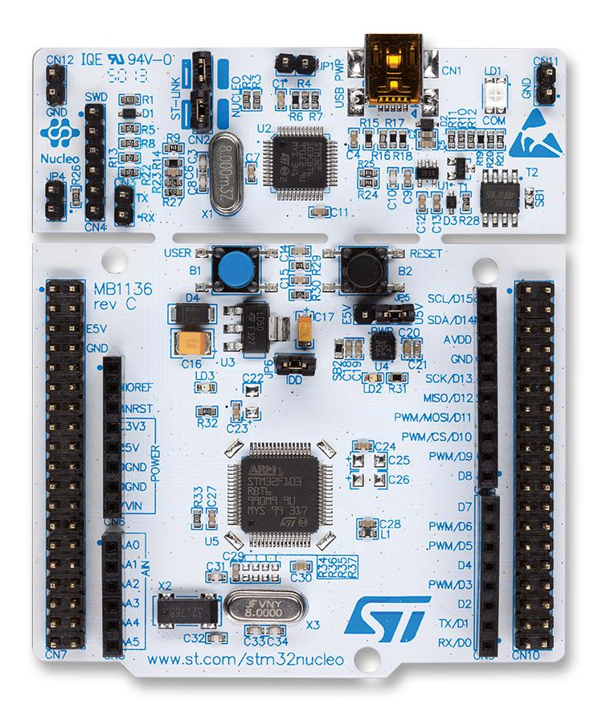
   
  
  <i>Figura 1: Placa nucleo F103Rb.</i>

#### 2.3.2. Módulo integrado de Bluetooth de baja energía (BLE).
Se utilizó el Módulo embebido que transmite y recibe información por Bluetooth. Dicho componente se comunicó con el microcontrolador a través de una interfaz UART.

  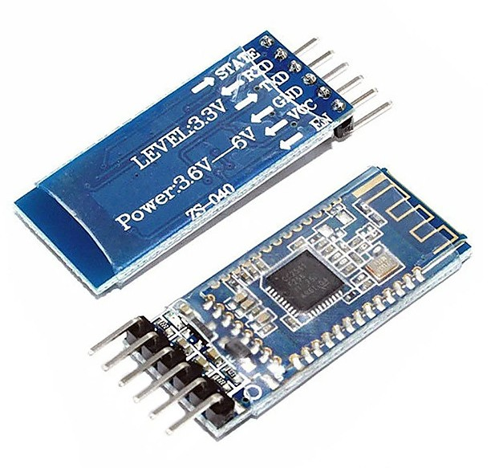
   
  
  <i>Figura 2: Modulo de BLE.</i>

#### 2.3.3. Módulo Relay optoacoplado de 2 canales.
El módulo de Relay de 2 Canales de lógica invertida se utilizó para controlar la corriente de las bombas, actuando como un interruptor que responde a una señal enviada a través de los pines GPIO.

  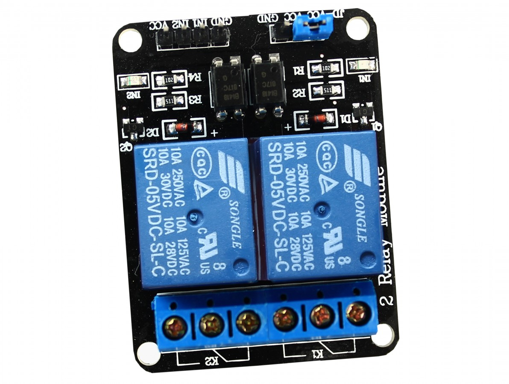
   
  
  <i>Figura 3: Modulo relay..</i>

#### 2.3.4. Módulo de memoria no volátil EEPROM (AT24C256).
Se utilizó una Memoria EEPROM de 256 Kbits, organizada en 32,768 palabras de 8 bits cada una, que se utiliza para almacenar datos de manera no volátil, es decir, que no se borran al apagar el dispositivo, y funciona a través de la interfaz de comunicación I2C.

  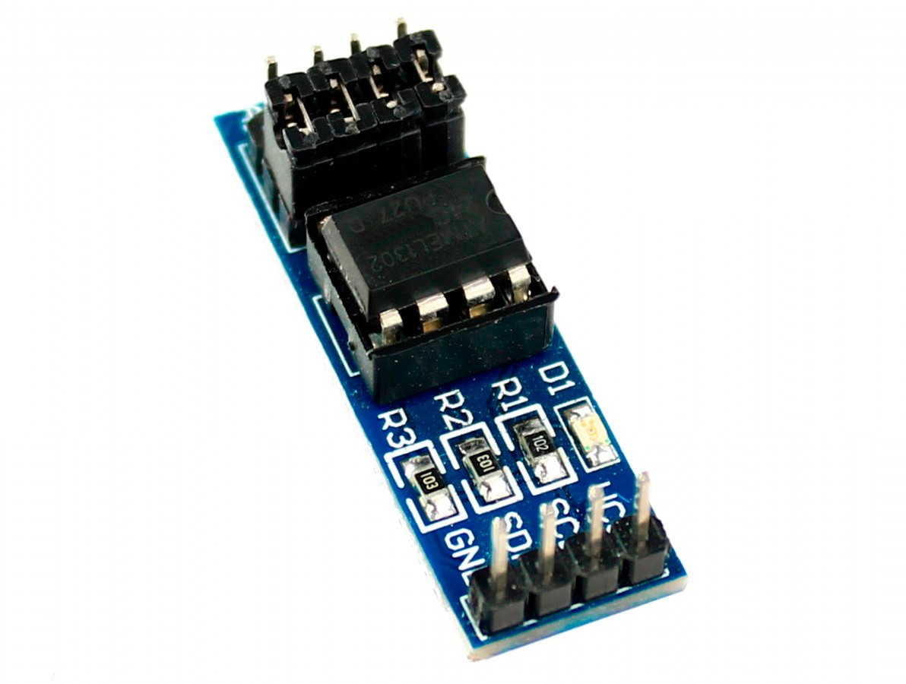
   
  
  <i>Figura 4: Modulo EEPROM.</i>

#### 2.3.5. Aplicación móvil para Android (MIT APP Inventor).
En este trabajo, se utilizó esta herramienta de desarrollo de APP móvil para la comunicación sencilla por BLE.

  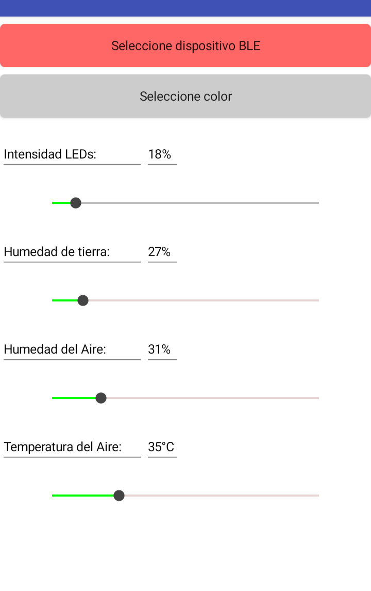
   
  
  <i>Figura 5: Interfaz de usuario de la app movil.</i>

#### 2.3.6. Módulo de sensor analógico de nivel de agua en tanque (HW-038).
Este sensor mide el nivel de agua en un tanque de forma resistiva y se utilizó para enviar una señal analógica a partir de eso, la cual se procesó mediante el conversor analógico-digital (ADC) del microcontrolador.

  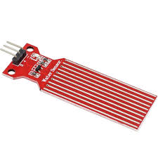
   
  
  <i>Figura 6: Modulo HW-038.</i>

#### 2.3.7. Módulo de sensor analógico de nivel de humedad en tierra (HW-390).

Este sensor mide el nivel de humedad en una maceta de forma capacitiva y, en este trabajo, se utilizó para enviar una señal analógica representativa de la permitividad eléctrica del suelo, la cual se procesó mediante el conversor analógico-digital (ADC) del microcontrolador.

  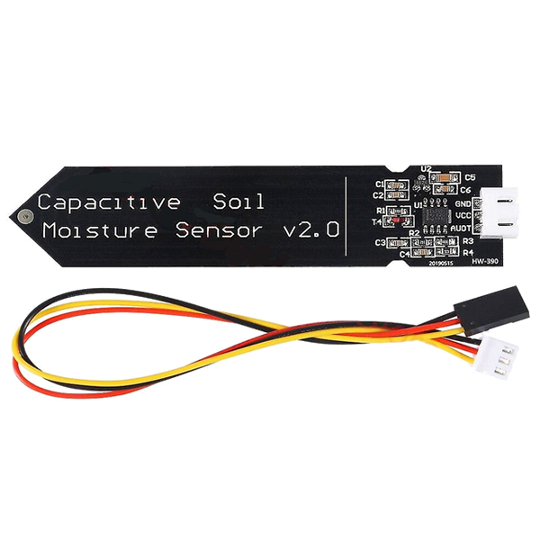
   
  
  <i>Figura 7: Modulo HW-390.</i>

#### 2.3.8. Módulo de sensor digital de temperatura y humedad en ambiente (AHT10).

Este sensor mide temperaturas desde -40°C a 80°C y porcentaje de humedad ambiente. En este trabajo, se utilizó para transmitir dicha información de forma digital mediante el protocolo I2C, con el fin de controlar el entorno cerrado del sistema.

  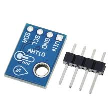
   
  
  <i>Figura 8: Modulo AHT10.</i>

#### 2.3.9. Módulo de alimentación de corriente continua de 12V.

Para la alimentación del sistema, se utilizó una fuente de corriente continua regulada de 12V y 10A alimentada por corriente de red.

  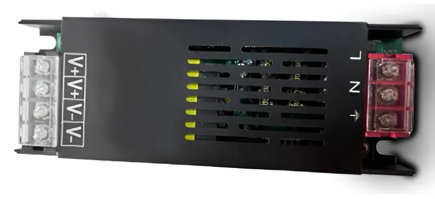
   
  
  <i>Figura 9: Modulo fuente 12V.</i>

# 3. Diseño e implementación.

En esta sección se presenta el desarrollo para poder elaborar el trabajo. Se presentan como están comunicados los distintos sistemas, el diseño de circuitos, la implementación física de los mismos y el funcionamiento del firmware.

## 3.1. Esquema general.

### 3.1.1. Diagrama en bloques
En la Figura 9 se muestra el diagrama en bloques del sistema con los principales módulos del proyecto y las funciones del microcontrolador que las relaciona entre sí.

  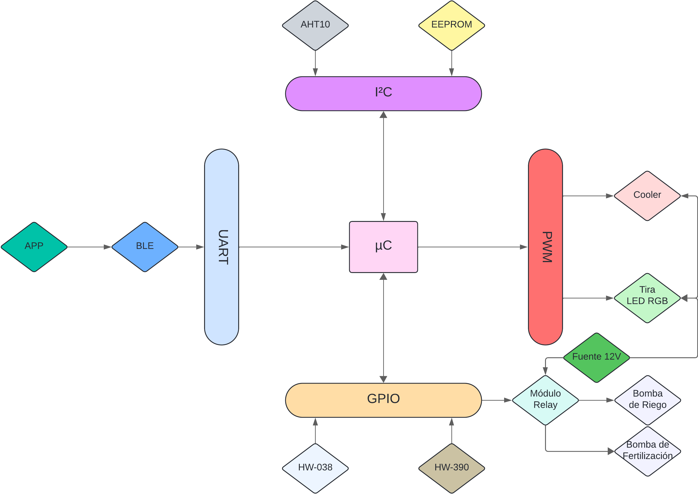
   
  
  <i>Figura 9: Esquema del diseño.</i>

## 3.2. Diseño de circuitos e implementación

### 3.2.1. Diseño de circuitos y módulos
Dado el esquema general del trabajo, se presenta la asignación de pines para la conexión de todos los módulos en la tabla 5.

| PIN | USO |
| :--- | :--- |
| PA0 | Humedad de suelo |
| PA1 | Tanque Agua |
| PA4 | Tanque Fertilizante |
| PA9 | PWM Azul |
| PA10 | PWM Verde |
| PB0 | Riego |
| PB6 | PWM Rojo |
| PB8 | SCL AHT10 |
| PB9 | SDA AHT10 |
| PB10 | SCL EEPROM |
| PB11 | SDA EEPROM |
| PC1 | Fertilización |
| PC10 | BLE RX |
| PC11 | BLE TX |

<em>Tabla 5: PINOUT del sistema.</em>

Además de los módulos externos descriptos en la sección de descripción de módulos externos, se diseñaron dos módulos para poder implementar correctamente el sistema de iluminación dinámica y el sistema de riego.

#### 3.2.1.1. Diseño de módulo de Iluminación Dinámica.

La tira LED adquirida, al igual que la mayoría de alternativas del mercado, necesitan ser alimentadas con 12 V CC. Dado que las señales PWM que puede aportar el microcontrolador llegan hasta una amplitud de 3,3 V, es necesario diseñar un circuito que permita controlar y alimentar la iluminación mientras se protege la integridad de los pines del microcontrolador.

El diseño se basó en el uso de transistores NMOS de nivel lógico. Sobre este se aplica la señal PWM sobre el pin Gate de forma tal que el semiconductor funcione como un interruptor que cierra el circuito cuando la señal se encuentre en su periodo de trabajo encendido. Esto se logra ya que en dicho momento el dispositivo entra en modo de funcionamiento de saturación permitiendo el flujo de corriente entre Drain y Source. Luego, al conectar un extremo de los LED a la alimentación, el otro extremo al Drain de MOSFET y el Source a común, la tira funciona con la misma frecuencia y tiempo de trabajo que la señal aportada por el controlador.

A partir de este funcionamiento, se toman ciertas precauciones en el diseño para garantizar una polarización correcta y un nivel de seguridad mínima de los dispositivos involucrados. Por ello, se agregó una resistencia de 220 Ω entre el PIN de salida PWM y el Gate y una resistencia de 10 kΩ entre el Gate y Común.

El esquemático del diseño se puede ver en la figura:

  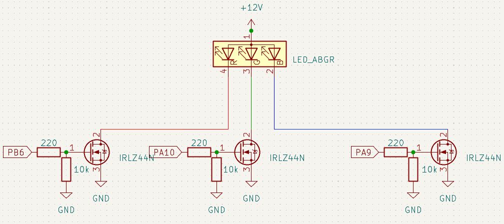
   
  
  <i>Figura 10: Esquemático módulo de iluminación dinámica.</i>

#### 3.2.1.2. Diseño de módulo de Riego.

Las bombas de riego adquiridas son escencialmente motores de corriente continua que funcionan con 12 V. Por ello, suelen funcionar con niveles de corriente relativamente altos (hasta 1.5A) que, una vez apagan las bombas, pueden quedar residuos que las pueden dañar severamente. Para evitar eso, se añadió un diodo 1N4007 invertido y paralelo a cada bomba. De esta forma, las características intrínsecas del diodo hace que permita usarlo como un realimentador que estabiliza el drenaje de esa corriente residual.

El esquemático del diseño se puede ver en la figura:

  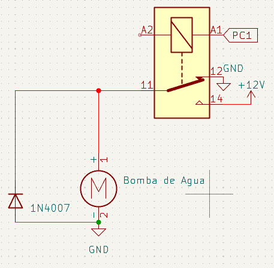
   
  
  <i>Figura 11: Esquemático módulo de riego.</i>

### 3.2.2. Implementación.

El diseño del sistema se pensó en base a distintos módulos, segmentando las funciones en diferentes unidades independientes para optimizar la robustez y la seguridad de la misma. Esta decisión se tomo en base a la necesidad de aislar el circuito de control principal. Dado que los sensores de humedad de suelo y nivel de agua operan en proximidad constante con líquidos, se optó por un módulo independiente que protege la placa principal ante posibles filtraciones y ambientes de alta humedad, facilitando además una ubicación más estratégica de los sensores dentro del invernadero.

Siguiendo esta lógica por funcionalidad y seguridad, se implementó un módulo específico para la iluminación LED. Debido a la corriente requerida por estos componentes y la necesidad de un circuitos dedicado, esta modularización permitió simplificando el diseño general y mejorando la integridad de las señales. De manera similar, se desarrolló un tercer bloque destinado a los actuadores de mayor consumo ya que estos deben ser alimentados con un fuente de 12 V, como las bombas de riego y el cooler. Al situar las bombas en un módulo cerca de los líquidos, se mejora la distribución y el impacto del los ruidos propios de los motores sobre el microcontrolador.

Finalmente, la placa general de hardware se centraliza en una placa base de distribución que funciona como el nodo del sistema. Sobre esta se monta la placa Nucleo (STM32F103RB), encargándose de la gestión de energía (5 V y 3,3 V) necesaria para los modulos y sensores, ademas de distribuir la tension de la fuente independiente necesaria de 12 V. Asimismo, esta placa actúa como un bus de las señales de control de los pines GPIO, PWM e I2C hacia los distintos módulos implementados, garantizando una distribución de la información y la energía de forma robusta, organizada y eficiente.

La implementación física del hardware, diseñada para garantizar robustez y seguridad, se detalla en las siguientes figuras. En las Figuras 12 y 13 se presenta la placa base central; por su parte, la Figuras 14 y 15. Finalmente, las Figuras 16 y 17 exponen dichos bloques, respectivamente. En estas capturas se aprecia la disposición de los componentes y el ruteado de pistas.

**Módulo general de la placa de hardware diseñada:**

  
   
  
  <i>Figura 12: Vista frontal placa general.</i>

  
   
  
  <i>Figura 13: Vista posterior placa general.</i>

**Módulo de control de bomba y cooler:**

  
   
  
  <i>Figura 14: Vista frontal bomba/cooler.</i>

  
   
  
  <i>Figura 15: Vista posterior bomba/cooler.</i>

**Módulo de control de sensores:**

  
   
  
  <i>Figura 16: Vista frontal sensores.</i>

  
   
  
  <i>Figura 17: Vista posterior sensores.</i>

**Módulo de control de leds:**

  
   
  
  <i>Figura 18: Vista frontal leds.</i>

  
   
  
  <i>Figura 19: Vista posterior leds.</i>

## 3.3. Funcionamiento de software.

El sistema consta de un programa principal denominado $app.c$. Este se encarga de ejecutar las tareas una por una en menos de 1ms.
A continuación se describen detalladamente las tareas que se desarrollaron para la implementación de este trabajo. Las mismas siguen un esquema *bare-metal* con *super-loop* y un *tick* de sistema de 1 ms.

### 3.3.1. Task Sensor Analog.

Esta tarea inicia, ejecuta, verifica y deriva la conversión analógico-digital (ADC) de los sensores analógicos. Para cada sensor descripto hace una lectura, la compara con los límites probados de cada dispositivo y la valida para luego enviarla a la tarea Task System Riego o Task System Level ó la rechaza y pide una nueva lectura para verificar si es un fallo o un simple glitch.

### 3.3.2. Task Sensor Digital.

Esta tarea inicia, ejecuta, verifica y deriva la lectura de la información digital aportada por el sensor de humedad y temperatura ambiental a través de I2C. Este protocolo lo utiliza con interrupciones que disparan las banderas de recepción de información que derivan a la verificación y posterior validación o rechazo de las lecturas.

### 3.3.3. Task Sensor BLE.

Inicia y ejecuta la recepción de una lista de enteros mediante UART. Para garantizar un buen manejo de tiempos y no ocupar innecesariamente la CPU hasta completar la lectura, la recepción se realiza mediante DMA. Luego, se realizan dos verificación para esa lista de valores: si es distinta a la recibida anteriormente y si cada valor respeta los límites impuestos para el correcto funcionamiento del sistema. Finalmente, guarda los datos nuevos en un buffer para una próxima comparación y los envía para ser guardados en la memoria no volátil.

### 3.3.4. Task System Memory.

Realiza la lectura y escritura de preferencias o configuraciones del sistema. Inicialmente, hace una lectura para recuperar la configuración previa al inicio del sistema (si existe dicha configuración) y la envía a todos los sistemas que la utilizan. Luego, si el Task Sensor BLE envía nueva información ya verificada, se ejecuta la sobreescritura de la configuración y el envío de la misma a los sistemas. Tanto la lectura como la escritura se realizan mediante interrupciones que levantan las banderas una vez finalizadas que desencadenan los pasos descriptos. 

### 3.3.5. Task System Level.

Esta tarea procesa la información escrutada en la tarea Task Sensor Analog para los sensores de nivel de tanque (que cuentan cada uno con su identificador). Se mantiene en estado de reposo la mayor parte del tiempo, verificando que los valores recibidos no bajen de los umbrales seguros, con una pequeña diferencia entre los valores para evitar cambiar de estado constantemente si se establece un único límite. Si ocurre eso, activa una bandera en la tarea Task System Riego, que impide totalmente la configuración y uso de las bombas. Por otro lado, también calcula un delta para evitar saltos abruptos, ya que el sensor al ser resistivo es muy sensible y suele tener *glitches*.

### 3.3.6. Task System Riego.

Esta tarea procesa la información recibida desde los sensores de suelo, ambiente y el sistema de tanques. La información escrutada por los sensores es procesada mediante la creación de un coeficiente ponderado que otorga mayor prioridad de las condiciones del suelo. Su diseño se realizó con la intención de ser predictivo, utilizando las condiciones climáticas del ambiente para lograr evitar el regado continuo.
Este coeficiente parte del cálculo de los errores de las mediciones respecto de los valores seteados por el usuario mediante la aplicación móvil, como se encuentra en la ecuación:

$$E_s = S_{set} - S_{act} \quad ; \quad E_t = T_{act} - T_{set} \quad ; \quad E_h = H_{set} - H_{act}$$

Luego, el sistema calcula el factor de clima, ponderando cada error dependiendo de su signo, como se observa en la siguiente ecuación. Para este trabajo, se asignó un mayor peso si la temperatura es superior a la deseada, debido a que ocurre una evaporación mayor del agua en un periodo más corto de tiempo. Para la humedad, el sistema penaliza fuertemente el exceso, ya que en un entorno *indoor* el riego innecesario puede provocar daños en la planta. Con estos parámetros, se define el factor de clima como el máximo entre la suma de cada factor o un limite definido como el 40% del error de suelo, garantizando que las condiciones climáticas no eviten el riego si el sensor capacitivo registra valores críticos.

$$K_t = \begin{cases} 0.020 & \text{si } E_t > 0 \\ 0.015 & \text{si } E_t \leq 0 \end{cases} \quad , \quad K_h = \begin{cases} 0.01 & \text{si } E_h > 0 \\ 0.15 & \text{si } E_h \leq 0 \end{cases}$$

$$F_{clima} = \max(0.4, 1.0 + K_t \cdot E_t + K_h \cdot E_h)$$

Se define a la contante de riego como el producto del factor de clima y el error de suelo. Se buscó que el factor climático actuara como un ponderador, permitiendo que las condiciones del entorno ajustaran la intensidad del riego final de manera proporcional.

$$C_{riego} = E_s \cdot F_{clima}$$

El valor del coeficiente de riego se evalúa constantemente, si pasa cierto umbral definido, envía al actuador de bombas la directriz de iniciar el riego por cierta cantidad de ticks. Los ticks se definieron considerando el caudal nominal de la bomba definido por del fabricante, como se expresa en la ecuación:

$$T_{calc} = C_{riego} \cdot 250.0$$

Los ticks finales que se envían al actuador están acotados por un umbral mínimo y máximo. Estos límites se definieron considerando una maceta de volumen estándar (aproximadamente 3 a 5 litros). Asimismo, el umbral mínimo se determinó para garantizar que el fluido logre vencer la inercia y atravesar la longitud total del conducto, asegurando el riego efectivo.

$$T_{ticks} = \text{clamp}(T_{calc}, 2000, 12000)$$

Finalmente, el sistema inicia una cuenta atrás de la suma de los ticks de riego calculados y un tiempo de espera que se definió para la correcta absorción del agua. Luego se vuelve a procesar la información.

### 3.3.7. Task System LED.

Esta tarea recibe las preferencias de iluminación definidas en la EEPROM. Esta información es previamente enviada por el usuario mediante la aplicación móvil y el Modulo BLE. Luego se procesa y se comunica al actuador si ocurre un cambio de color y/o de intensidad en cada uno de los colores.

### 3.3.8. Task System Ventilación.

Esta tarea procesa la información de temperatura y humedad ambiental y la contrasta con las preferencias configuradas a través del usuario, mediante la elaboración de errores, como se observa en la siguiente ecuación:

$$E_t = T_{act} - T_{set} \quad ; \quad E_h = H_{act} - H_{set}$$

Para evaluar la necesidad de ventilar, el sistema calcula el coeficiente de ventilación, que se definió como la suma de ambos errores, dándole mayor prioridad a las condiciones de humedad, debido a que se trata de entorno cerrado, donde la humedad es un factor critico. 

$$C_{ven} = E_t + (1,5 \cdot E_h)$$

Si el coeficiente de ventilación supera el umbral establecido, envía a la tarea *Task Actuator Cooler* la directriz para iniciar la ventilación en su máxima potencia. Tras un intervalo de ticks determinado, se ajusta dinámicamente la velocidad mediante la señal PWM y el coeficiente de ventilación, estableciendo máximos y mínimos que garanticen el funcionamiento correcto del cooler:

$$PWM_{calc} = (C_{ven} - 3,0) \cdot 50$$

$$PWM_{final} = \text{clamp}(PWM_{calc}, 300, 1000)$$

### 3.3.9. Task Actuator Cooler.

Esta tarea recibe las direcciones de su sistema y, si ordena salir del reposo (estado OFF), realiza la configuración del PWM en función del periodo de trabajo recibido.

### 3.3.10. Task Actuator LED.

Esta tarea recibe las direcciones de su sistema y realiza la configuración de las señales PWM para cada color de la tira LED dependiendo del color deseado.

### 3.3.11. Task Actuator Bomba.

Esta tarea recibe la dirección de accionar o no y por cuanto tiempo cada una de las bombas (riego y fertilización). Las bombas tienen lógicas de activación distintas. Para la bomba de riego, se estableció un funcionamiento por stock, que se activa si el sistema de agua notifica que hay fertilizante en el tanque, dosificando una cantidad definida y luego esperando 24 horas para efectuar, si se puede, la siguiente dosificación.
Por otro lado, la bomba de riego se activa una cantidad definida de ticks definida por la tarea sistema de riego.

# 4. Resultados de las mediciones
En esta sección se presentan las mediciones hechas sobre las pruebas de hardware y de software. Entre las pruebas de hardware se encuentran la prueba de funcionamiento de los módulos, el factor de uso de la CPU, el consumo de corriente del microcontrolador y el uso de FLASH y RAM del microcontrolador.

## 4.1. Pruebas funcionales de hardware y de software.

Se realizaron distintas mediciones y pruebas sobre el funcionamiento tanto de hardware (tabla 6) como de software (tabla 7), los cuales se detalla el ensayos utilizo ademas de los resultados obtenidos del mismo.

### Registro de ensayos y pruebas de funcionamiento del sistema.
| Ensayo | Resultado | Estado |
| :--- | :--- | :---: |
| Prueba de sensores analógicos | Se logró la medición correcta de los mismos. | 🟢 |
| Medición del sensor digital DHT22 | No se logró la medición correcta utilizando código no bloqueante. | 🔴 |
| Implementación del sensor digital AHT10 (Temp. y Hum.) | Se logró implementar y sensar correctamente mediante interrupciones y código no bloqueante. | 🟢 |
| Envío de datos desde la aplicación hacia el módulo BLE | Se obtuvo una correcta recepción de los mismos. | 🟢 |
| Implementación del circuito de LEDs | Se verificó el funcionamiento correcto del circuito de LEDs. | 🟢 |
| Prueba de bombas, relés y circuito implementado | Se obtuvo un funcionamiento correcto. | 🟢 |
| Implementación y verificación de placas (continuidad y comunicación) | Tras realizar modificaciones en el diseño de las placas, se alcanzó un resultado funcional correcto. | 🟢 |
| Comunicación entre placas para la fuente independiente de 12V | Se logró una correcta distribución de la línea de 12V hacia los diferentes módulos. | 🟢 |

<em>Tabla 6: Registro de ensayos y pruebas de funcionamiento del sistema.</em>

### Registro de ensayos y pruebas de funcionamiento software.
| Ensayo | Resultado | Estado |
| :--- | :--- | :---: |
| Verificación del funcionamiento de la memoria EEPROM | Se logró realizar la lectura y escritura de los datos de manera exitosa. | 🟢 |
| Prueba de sensores analógicos, filtrado de glitches internos y mapeo de los mismos | Se logró el filtrado de los errores de los glitches, además de mapear correctamente los valores medidos de los sensores. | 🟢 |
| Alteración de diferentes datos de los sensores en las distintas tareas para verificar la comunicación entre sistemas | Se obtuvo la correcta comunicación e intercambio de datos entre las tareas. | 🟢 |
| Implementación de verificaciones y validaciones en las tareas con estados de error; se forzó la entrada a dichos estados para verificar el comportamiento | Las tareas se comportaron de forma adecuada, entrando en estado de error y retornando al funcionamiento normal una vez validadas las condiciones. | 🟢 |
| Prueba de señales PWM para los LEDs y verificación de cambios de estado e intensidad mediante código | Se comprobó el cambio de colores y de intensidades correctamente, validando el funcionamiento de los canales PWM. | 🟢 |
| Lectura de temperatura y humedad mediante I2C con el sensor AHT10, implementando interrupciones y verificación de estados de error ante cambios bruscos | Se obtuvo un funcionamiento correcto de la lectura y de las interrupciones, validando la respuesta del sistema ante condiciones críticas y errores. | 🟢 |
| Prueba de señales PWM para los relés y verificación de cambios de estado para el correcto funcionamiento | Se obtuvo el funcionamiento correcto de los mismos mediante la implementación del PWM. | 🟢 |
| Implementación de la comunicación inalámbrica mediante el módulo BLE vía UART | Se logró la recepción del ble y el envío de datos mediante UART. |🟢 |

<em>Tabla 7: Registro de ensayos y pruebas de funcionamiento de software.</em>

Los resultados obtenidos confirman que el sistema funciona de manera estable. En cuanto al hardware, la construcción de los módulos permitió manejar correctamente la potencia de 12 V y proteger al microcontrolador. Aunque inicialmente el sensor DHT22 no funcionó con código no bloqueante, el problema se resolvió con el cambio al sensor AHT10, logrando mediciones más fluidas y precisas.

En el aspecto del software, se verificó que las tareas se comunican entre sí sin errores y que los mecanismos de seguridad responden bien ante fallos simulados. La correcta gestión de las señales PWM y de la memoria EEPROM asegura que el dispositivo puede controlar la iluminación y el riego de forma autónoma, cumpliendo con los objetivos planteados para el proyecto.

## 4.2. Prueba de integracion

Acontinuacion se adjunta el link del sistemas en funcionamiento: 

https://drive.google.com/file/d/1bl58Yt1DkdqtW3qHbJ-Gf5lO0u4VhL3R/view?usp=sharing

## 4.3. Medición y análisis de tiempos de ejecución de cada tarea (WCET)

Se realizaron distintas mediciones con el objetivo de analizar los peores tiempos de ejecución de cada tarea para, a posteriori, detallar el uso de la CPU durante la ejecución funcional del sistema. Los datos obtenidos se vuelcan en la Tabla 8. En dicha tabla se detalla en cada columna: la tarea; el *WCET Base*, que representa la ejecución de la tarea sin procesamiento de datos externos (estado de reposo); y el *WCET Activo*, que contempla la ejecución completa incluyendo la gestión de periféricos, como las bombas de agua, y el envío de datos desde la aplicación mediante el módulo BLE.

| Tarea | WCET Base | WCET Activo |
| :--- | :---: | :---: |
| Task System Memory | 7 μs | 8 μs |
| Task Sensor Analog | 21 μs | 23 μs |
| Task Sensor Digital | 36 μs | 36 μs |
| Task Sensor BLE | 3 μs | 6 μs |
| Task System Ventilación | 16 μs | 16 μs |
| Task System LED | 4 μs | 4 μs |
| Task System Level Tanque | 4 μs | 10 μs |
| Task System Riego | 21 μs | 25 μs |
| Task Actuator Bomba Agua | 4 μs | 7 μs |
| Task Actuator Cooler | 31 μs | 32 μs |
| Task Actuator LED | 63 μs | 63 μs |
| **Total** | **210 μs** | **230 μs** |

<em>Tabla 8: Comparativa de tiempos de ejecución (WCET).</em>

Los resultados reflejan una alta eficiencia, con un tiempo total de apenas 230 $\mu$s en el peor de los casos. Esta velocidad asegura que el sistema procesa la información de manera casi instantánea, dejando al microcontrolador libre la mayor parte del tiempo. La pequeña diferencia entre el estado base y el activo confirma que el envío de datos y el control de periféricos no sobrecargan al procesador, permitiendo un funcionamiento fluido.

## 4.4. Cálculo del Factor de Uso (U) de la CPU

A partir de los tiempos obtenidos en las mediciones anteriores, se presenta el cálculo del factor de utilización de la CPU. Para este análisis, se consideró que el temporizador del sistema (*Systick*) fue configurado con un período de $1 \ \text{ms}$, el cual actúa como la unidad de tiempo base para la planificación de las tareas.

El factor de uso $U$ se calcula mediante la sumatoria del cociente entre el tiempo de ejecución de cada tarea ($C_i$) y su período respectivo ($T_i$), siguiendo la fórmula:

$$U = \sum_{i=1}^{n} \frac{C_i}{T_i}$$

En este trabajo, para el cálculo de $U$ se utilizan los valores de *WCET Activo*, ya que se quiere evaluar el peor caso de uso de la CPU.

El resultado obtenido para el factor de uso es $U = 0,23$, lo que significa que se utiliza el $23\%$ de la capacidad de la CPU para el funcionamiento de este trabajo. Dados estos resultados, se observa que es posible implementar un modo de ahorro de energía para el microprocesador, optimizando así el consumo general del sistema.

## 4.5. Medición y análisis de consumo

El objetivo de este apartado es determinar el consumo de corriente del microcontrolador bajo distintos modos de operativos. Se evaluaron principalmente dos estados: el Modo Run (ejecución activa) y el Modo Sleep. En este último, el procesador detiene su núcleo tras completar las tareas programadas, optimizando así el uso de la energía.

Para realizar un análisis integral, se midió la corriente en dos puntos críticos del hardware: el consumo específico del microcontrolador a través del bus de $3,3 \ \text{V}$ (medido en el jumper JP6) y la corriente total entregada por la etapa de potencia de $5 \ \text{V}$ (medida en el jumper JP5). Dentro del modo de ejecución activa, se distinguieron dos condiciones:

* Modo Run (Mínimo): El sistema operando con la configuración base, sin actuación de periféricos de potencia.
* Modo Run (Máximo): El sistema bajo carga máxima, con todos los actuadores (bombas, ventiladores y LEDs) y periféricos de comunicación en funcionamiento simultáneo.

Como se detalla en la Tabla 9, la implementación del Sleep Mode permite una disminución significativa de la corriente consumida una vez finalizada las tareas de procesamiento.

| Punto de Medición | Modo Run (Mínimo) | Modo Run (Máximo) | Modo Sleep |
| :--- | :---: | :---: | :---: |
| 3V3 (Jumper JP6) | 42 mA | --- | 28 mA |
| 5V (Jumper JP5) | 88 mA | 208 mA | 46 mA |

<em>Tabla 9: Comparativa de consumo energético.</em>

Los resultados demuestran que el *Modo Sleep* reduce el consumo del microcontrolador en un 33\% respecto a su estado de ejecución mínima. Es notable que el consumo total del sistema en 5V disminuye de $88 \ \text{mA}$ a $46 \ \text{mA}$, lo que indica que la detención del núcleo no solo ahorra energía en el procesador, sino que también reduce la actividad residual de los buses de comunicación y la carga sobre los reguladores de la placa. 

El pico de $208 \ \text{mA}$ observado en el modo máximo se debe a la actuación simultánea de todos los periféricos. Si bien representa una corriente elevada, este estado es transitorio y no se mantiene durante periodos prolongados. Dicho incremento es causado eventualmente por la conmutación de los relés, los cuales generan un pico de consumo en el instante de activación, estabilizándose en un lapso muy breve una vez completada la acción de los mismos.

## 4.6. Reporte de uso

Se analizó la eficiencia del programa tras la compilación. En las figuras 20 y 21 se presentan la salida de la consola y el build analyzer, respectivamente.

  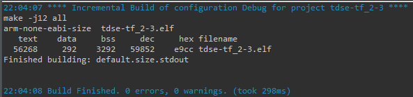
   
  
  <i>Figura 20: Resumen de compilación.</i>

  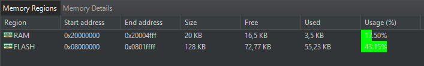
   
  
  <i>Figura 21: Ocupación de memoria Flash y RAM..</i>

Según los reportes, el código utiliza el 43,15% de la memoria Flash (55,23 KB) y el 17,50% de la memoria RAM (3,5 KB). Esto confirma que el microcontrolador tiene amplia capacidad disponible para operar de forma estable y admitir futuras expansiones del código.

## 4.7. Cumplimiento de requisitos.

A lo largo del desarrollo, varios requisitos fueron cambiando de forma. Estos cambios se pueden ver en la siguiente tabla 10.

| Grupo | ID | Descripción |
| :--- | :---: | :--- |
| **Sensores ambientales** | 1.1 | El sistema cuenta con un sensor de temperatura y humedad ambiente (AHT10) para supervisar condiciones del cultivo. |
| | 1.2 | El sistema cuenta con un sensor de humedad de suelo capacitivo por maceta/zona para gobernar el riego automático. |
| | 1.3 | El sistema realizará lecturas continuas con verificaciones. |
| **Actuadores --- Riego** | 2.1 | El sistema controla una bomba para activar riego en función del umbral de un coeficiente ponderado conformado por los valores de humedad de suelo, humedad ambiente y temperatura ambiente configurado. |
| | 2.2 | El sistema controla una bomba para activar la fertilización líquida en función del tiempo y de su disponibilidad. |
| | 2.3 | El riego es interrumpido automáticamente si se detecta falta de agua (sensor de nivel de tanque) o marcha en seco (protección). |
| **Actuadores --- Iluminación** | 2.4 | El sistema cuenta con una tira LED RGB (analógica o direccionable) para iluminación artificial del cultivo mediante señales PWM. |
| | 2.5 | La intensidad y el espectro (combinación R/G/B) son configurables desde la aplicación para definir fotoperíodos y etapas (crecimiento / fructificación). |
| **Actuadores --- Ventilación** | 2.6 | El sistema cuenta con un ventilador tipo PC (cooler) controlable por PWM para renovación de aire y control térmico local. |
| | 2.7 | El ventilador puede operar en modos definidos por firmware (control proporcional por temperatura/humedad), seleccionables desde la app. |
| **Almacenamiento** | 3.1 | La configuración del sistema (umbrales, fotoperíodos, parámetros) persiste en la memoria **EEPROM** externa. |
| | 3.2 | El sistema recupera la configuración guardada al iniciar y validará la integridad de la misma. |
| **Interfaz/App** | 4.1 | Toda la interacción de usuario, es decir, la configuración se realiza mediante la aplicación móvil conectada por BLE. |
| | 4.2 | La app permitirá configurar umbrales y programar fotoperíodos. |
| **Operación segura** | 5.1 | Si ocurre un evento inesperado que suponga un riesgo al sistema, el mismo deberá reiniciar con los actuadores en estado pasivo. |

<em>Tabla 10: Cumplimiento de requisitos.</em>

En algunos casos, esos cambios se debieron a la dificultad de adaptar el hardware a los requisitos de software impuestos (1.1, 3.1). En otros casos, se evaluó que la implementación del requisito sería compleja y retrasaría todo el desarrollo (4, 2.6).

De todas formas, el funcionamiento puro propuesto se pudo obtener exitosamente.

# 5. Conclusiones.
Para finalizar el presente trabajo, se reúnen los objetivos cumplidos y los próximos pasos a seguir.

## 5.1. Resultados obtenidos.
* Se logró producir un sistema de ejecución de tareas optimizado para que dure menos de 1ms.
* Se implementaron distintas tecnologías de la placa controladora (UART, PWM, I2C, GPIO, entre otros).
* Se implementaron distintas técnicas para optimizar el uso de la CPU (Interrupciones y DMA).
* Se comprendió el uso de la comunicación inalámbrica con el uso del módulo BLE.
* Se implementó el uso de una memoria no volátil.
* Se tomaron los recaudos necesarios para proteger al microcontrolador de los módulos de alta potencia.
* Se pudo implementar una aplicación móvil que envía al sistema las preferencias del usuario.
* Se desarrollaron las tareas de forma tal que haya la mayor cantidad de contingencias posibles hasta llegar a un error.

## 5.2 Próximos pasos.
* Se podrían implementar para cultivos más grandes, con el uso de más sensores de suelo.
* Se podría enviar información desde el sistema a la APP. Ya sean errores o información útil.
* Se podría definir un sistema de fertilización único que funcione a partir de las preferencias del usuario.
* Se podría agregar fuente de corriente continua externa para el uso de los módulos para reducir el uso de corriente de la placa.
